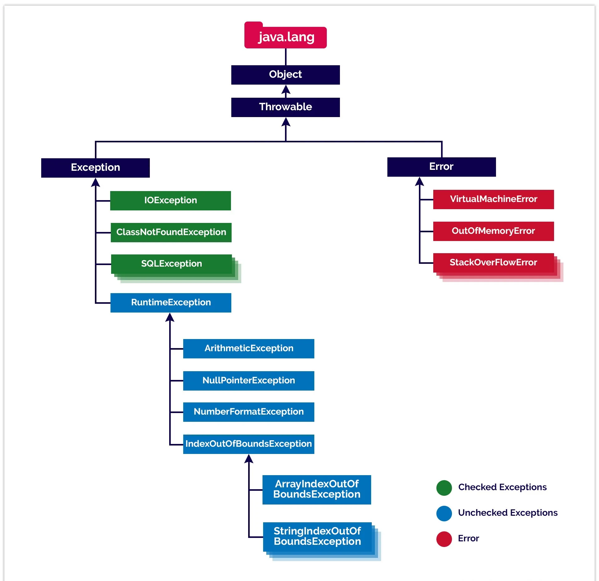

# Java Cheat Sheet

## String Manipulation

```java
char c = s.charAt(i);
```

```java
String front = s.substring(0, i);
String back = s. substring(i + 1);
s = front + "*" + back;
```

## Arrays

### Creating Arrays

```java
String[] names = new String[10];
```

### Initializing Arrays

```java
String[] names = {"One", "Two", "Three"};
```

```java
int[] primes = { 2, 3, 5, 7, 11, 13, 17 };
```

```java
int[] primes = new int[] { 2, 3, 5, 7, 11, 13, 17 };
```

_Note: The length of an array created with an initializer is determined by the number of values listed in the initializer._

### Looping thru Arrays

```java
for (int i = 0; i < players.length; i++)
    System.out.println(players[i]);
```

_Note: If you don’t have the array length handy, you can get it from the array’s_ `.length` _**property**. Recall using the_ `.length()` _**method** call for a String._

### Two-Dimensional Arrays

```java
double[][] sales = new double[5][4];
```

### Varargs

_Note: An important caveat about using_ `varargs` _is that the variable argument must always be the last argument in the argument list. This makes sense when you consider that, otherwise, the compiler wouldn’t be able to keep track of the arguments if any other than the last argument had a variable number._

**Example:**

```java
public static void PrintSomeWords(String… words)
{
    for (String word : words)
        System.out.println(word);
}
```

### Jagged Arrays

_Note: Java lets you create two-dimensional arrays in which the length of each element of the main array is different. This is sometimes called a **jagged array** because the array doesn’t form a nice rectangle. Instead, its edges are jagged._

**Example:**

```java

String[][] teams =
{
    {"Henry Blake", "Johnny Mulcahy"},
    {"Benjamin Pierce", "John McIntyre", "Jonathan Tuttle"},
    {"Margaret Houlihan", "Frank Burns"},
    {"Max Klinger", "Radar O'Reilly", "Igor Straminsky"}
};

for (String[] team : teams)
{
    for (String player : team)
        System.out.println(player);
    System.out.println();
}
```

## Loops

### `while` Loop

```java
int number = 0;

while (number < 20)
{
    number += 2;

    if (number == 12)
        continue;

    System.out.print(number + " ");
}

System.out.println();
```

### `do-while` Loop

```java
int number = 2;

do
{
    System.out.print(number + " ");
    number += 2;
} while (number <= 20);

System.out.println();
```

### `for` Loop

```java
System.out.print ("We are go for launch in T minus ");

for (int count = 10; count >= 0; count--)
{
    if (count == 8)
        System.out.println("Ignition sequence start!");
    else
        System.out.println(count + "…");
}
```

### `for-each` Loop

```java
String[] days = { "Sunday", "Monday", "Tuesday", "Wednesday", "Thursday", "Friday", "Saturday" };

for (String day : days)
{
    System.out.println(day);
}
```

_Note: It’s important to note that the_ `for-each` _loop gives you a copy of each item in the array, not the item itself. So, you can’t alter the contents of an array by using a_ `for-each` _loop._

## `switch` Statement

```java
System.out.println("The car wash application!\n\n");
System.out.print("Enter the package code: ");
String s = sc.next();
char p = s.charAt(0);

String details = switch (p)
{
    case 'E','e' -> packageE() + packageD() + packageC() + packageB() + packageA();
    case 'D','d' -> packageD() + packageC() + packageB() + packageA();
    case 'C','c' -> packageC() + packageB() + packageA();
    case 'B','b' -> packageB() + packageA();
    case 'A','a' -> packageA();
    default -> "That's not one of the codes.";
    };

    System.out.println("\nThat package includes:\n");
    System.out.println(details);
}

public static String packageA()
{
    return "\tWash, vacuum, and hand dry.\n";
}

public static String packageB()
{
    return "\tWax, plus … \n";
}

public static String packageC()
{
    return "\tLeather/Vinyl Treatment, plus … \n";
}

public static String packageD()
{
    return "\tTire Treatment, plus … \n";
}

public static String packageE()
{
    return "\tNew Car Scent, plus … \n";
}
```

## Dates and Times

TBD

## Variables and Data Types

### Primitive Data Types

| Data Type | Size    | Description                                                                       |
| :-------- | :------ | :-------------------------------------------------------------------------------- |
| `byte`    | 1 byte  | Stores whole numbers from -128 to 127                                             |
| `short`   | 2 bytes | Stores whole numbers from -32,768 to 32,767                                       |
| `int`     | 4 bytes | Stores whole numbers from -2,147,483,648 to 2,147,483,647                         |
| `long`    | 8 bytes | Stores whole numbers from -9,223,372,036,854,775,808 to 9,223,372,036,854,775,807 |
| `float`   | 4 bytes | Stores fractional numbers. Sufficient for storing 6 to 7 decimal digits           |
| `double`  | 8 bytes | Stores fractional numbers. Sufficient for storing 15 to 16 decimal digits         |
| `boolean` | 1 bit   | Stores true or false values                                                       |
| `char`    | 2 bytes | Stores a single character/letter or ASCII values                                  |

### Non-Primitive Data Types

TBD

## Abstract Class versus Interface

In Object-Oriented Programming (OOP), both abstract classes and interfaces serve as fundamental constructs for defining contracts. They establish a blueprint for other classes, ensuring consistent implementation of methods and behaviors.

### Abstract Class

- `abstract` keyword is used to create an abstract class and it can be used with methods.
- Subclasses use `extends` keyword to extend an abstract class and they need to provide implementation of all the declared methods in the abstract class unless the subclass is also an abstract class.
- Abstract classes can have methods with implementation whereas interface provides absolute abstraction and can’t have any method implementations.
- Abstract classes can have constructors.
- A subclass can extend only one abstract class.
  Abstract classes can extend other class and implement interfaces.
- Abstract classes can define contract and provide other method implementations for subclasses to use.

### Interface

- `interface` keyword is used to create interface and it can’t be used with methods.
- Subclasses use `implements` keyword to implement interfaces and should provide implementation for all the methods declared in the interface.
- Interfaces can not have constructors.
- Can implement multiple interfaces.
- Interface can only extend other interfaces.
- Interfaces are used to define contract for the subclasses.

## Exceptions

<!--  -->



### Checked Exceptions

- These are the exceptions that are checked at **compile time**.
- Any checked exception is a subclass of `Exception`.
- Checked exceptions in Java must be either caught or declared in the method signature, representing conditions outside the program’s control.
- If some code within a method throws a checked exception, then the method must either handle the exception or it must specify the exception using the `throws` keyword.
- **Fully Checked Exception** is where all its child classes are also checked (e.g., `IOException`, `InterruptedException`).

- **Partially Checked Exception** is where some of its child classes are unchecked (e.g., `Exception`).

### Unchecked Exceptions

- Unchecked exceptions are **runtime exceptions** that are not required to be caught or declared in a throws clause.
- Unchecked exceptions include all subclasses of the `RuntimeException` class, as well as the `Error` class and its subclasses.
